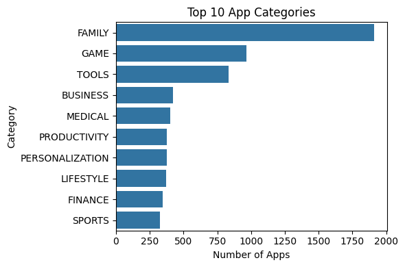
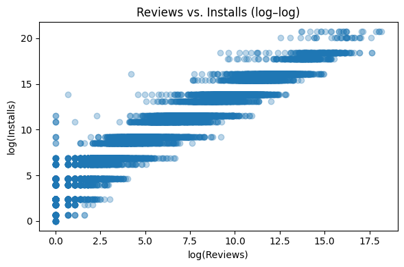
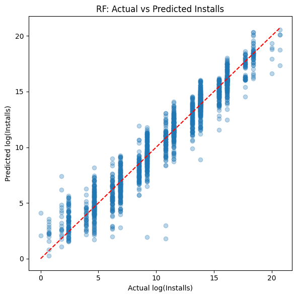
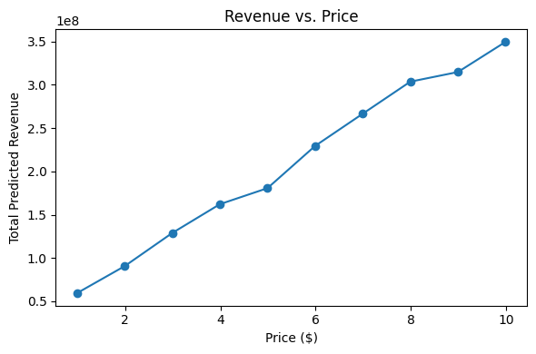

# Google Play Store Analytics

[](notebooks/playstore_analysis.ipynb)

## 📄 Project Summary
A predictive analytics project analyzing factors that drive app downloads, user ratings, and pricing strategies on the Google Play Store.

## 🎯 Objectives
- Perform data preprocessing and feature engineering  
- Train and evaluate predictive models for installs and ratings  
- Simulate price optimization for revenue maximization  
- Communicate results through visualizations and written insights  
- Reflect on ethical implications and model interpretability  

## ❓ Business Questions
1. **Download‑Volume Drivers**  
   _Which app attributes most influence install counts?_  
2. **Rating Prediction**  
   _Can we predict an app’s average user rating from its features?_  
3. **Price Optimization**  
   _What price maximizes total predicted revenue, accounting for price sensitivity?_  

## 📂 Dataset
- **Source:** Kaggle “lava18/google-play-store-apps”  
- **Link:** https://www.kaggle.com/datasets/lava18/google-play-store-apps  

## 🛠️ Tools & Libraries
- Python: pandas, NumPy, scikit-learn, matplotlib, seaborn  
- Google Colab for analysis and visualization  
- GitHub for code and report hosting  

## 🚀 How to Run
1. Open the Colab notebook:  
   `notebooks/playstore_analysis.ipynb`  
2. Install dependencies:  
   ```bash
   !pip install pandas numpy scikit-learn matplotlib seaborn kaggle

- **Distribution of log(Installs)**  
  .png)

- **Top 10 App Categories**  
  

- **Reviews vs. Installs**  
  

- **Rating by Top 5 Categories**  
  .png)

- **Feature Correlation Matrix**  
  .png)

- **RF: Actual vs Predicted Installs**  
  

- **Top 10 Feature Importances**  
  .png)

- **Revenue vs Price Curve**  
  
